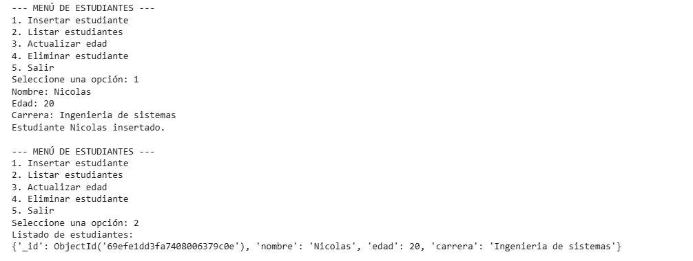
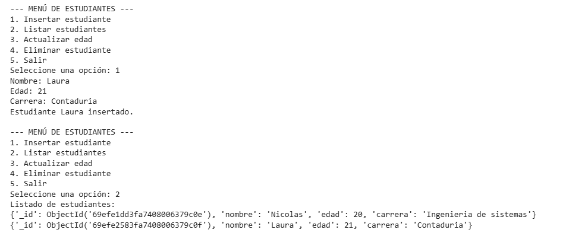
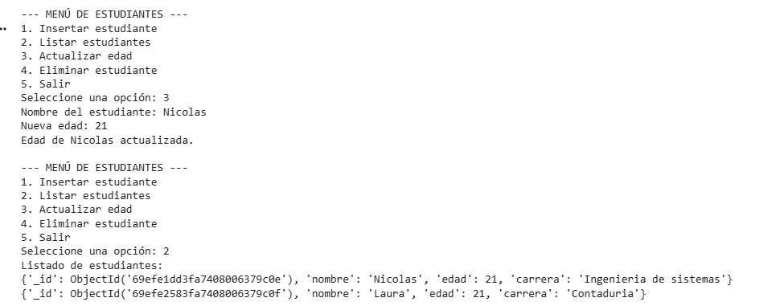
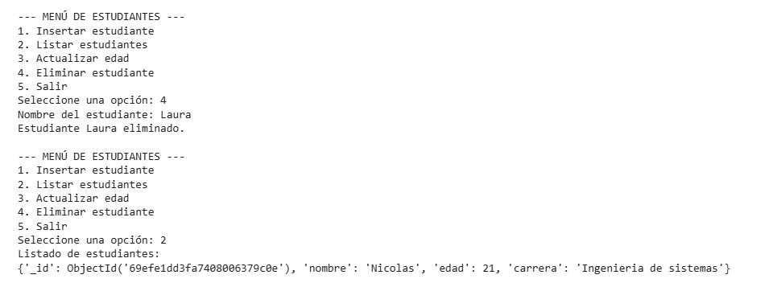
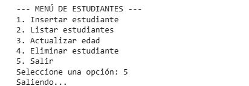
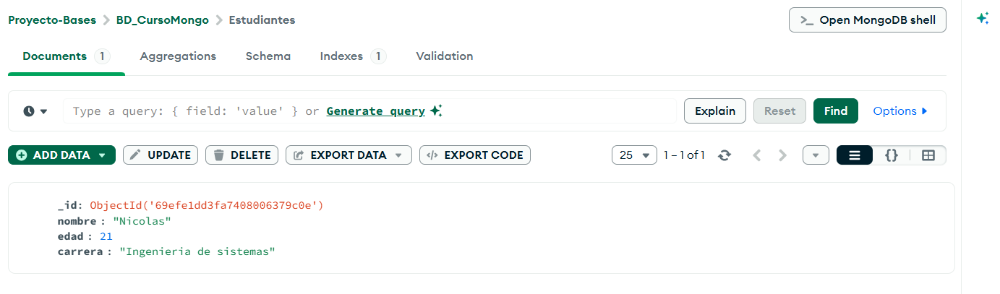

# Actividad MongoDB Atlas, Compass y Colab

## Estudiante

**Nicolás Barrera**
**Materia:** Bases de Datos

---

## Descripción

En esta actividad se realizó la creación de una base de datos en MongoDB Atlas, la conexión con MongoDB Compass y la manipulación de datos mediante Python usando PyMongo en Google Colab.

---

## MongoDB Atlas

Se creó un cluster en MongoDB Atlas y se configuró un usuario con contraseña. Se habilitó temporalmente el acceso desde cualquier IP (0.0.0.0/0) para permitir la conexión desde Google Colab.

---

## MongoDB Compass

Se utilizó MongoDB Compass para conectarse al cluster mediante la URI proporcionada. Desde Compass se visualizaron las bases de datos, colecciones y documentos creados.

---

## Google Colab y PyMongo

Se utilizó PyMongo para conectarse a la base de datos desde Python. Se implementaron operaciones CRUD:

* Insertar estudiantes
* Listar estudiantes
* Actualizar edad
* Eliminar estudiantes

---

## Resultados

Se creó la base de datos `school` con la colección `students`. Se realizaron pruebas exitosas de inserción, consulta, actualización y eliminación de documentos.

---

## Evidencias

### 🔹 Conexión a MongoDB (Colab)

### 🔹 Inserción de estudiante

### 🔹 Listado de estudiantes

### 🔹 Actualización de datos

### 🔹 Eliminación de estudiante

### 🔹 Visualización en MongoDB Compass

---

## Link del repositorio

https://github.com/nicolascasta202003-crypto/mongo-atlas-compass-colab-data-bases.git
